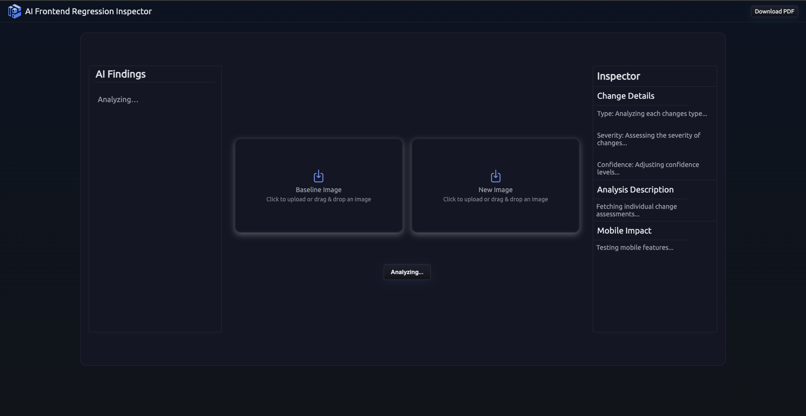
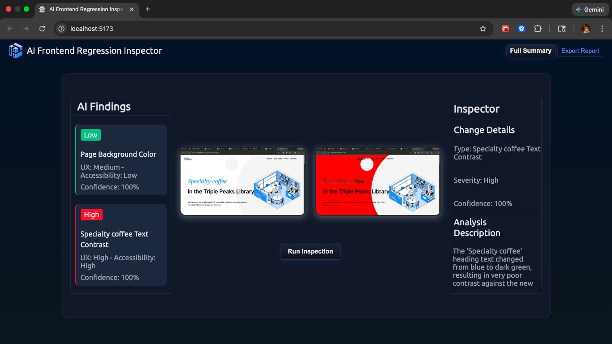

# AFRI — AI Frontend Regression Inspector

**AFRI (AI Frontend Regression Inspector)** is a developer-facing web application that compares screenshots from different frontend releases and uses **Google Gemini 2.5 Flash** to detect UI changes, summarize their impact, and evaluate them against **WCAG accessibility considerations**.

The goal is to explore how multimodal AI can assist with **visual regression analysis, accessibility review, and QA workflows**, while demonstrating best practices for AI integration and secure API usage.

---

## Why AFRI?

Frontend regressions are often visual, subtle, and time-consuming to review manually. AFRI explores how modern multimodal models can assist by:

- Comparing two UI screenshots
- Identifying meaningful visual changes
- Highlighting affected areas
- Providing structured, machine-readable analysis
- Surfacing potential accessibility concerns

This project is designed as a **learning and portfolio project**, but is structured in a way that reflects how such a tool could fit into real QA or CI workflows.

---

## Core Features

- **AI-generated change detection** between baseline and new screenshots
- **Image comparison** using multimodal model input
- **Bounding box visualization** to highlight detected changes
- **Confidence scoring** for each detected change
- **Accessibility analysis** with WCAG-related heuristics
- **Structured JSON output** for predictable downstream usage
- **Server-side Gemini integration** to keep API keys secure

---

## Tech Stack

### Frontend

- **React**
- **React Context** for state management

### Backend

- **Serverless functions** (Vercel or Netlify)
- **Node.js runtime**

### AI

- **Google Gemini 2.5 Flash**
- Multimodal (image + text) prompts
- Structured JSON responses for deterministic parsing

---

## Architecture Overview

At a high level:

- The client handles image selection, visualization, and UX
- The serverless backend:
  - Validates inputs
  - Calls the Gemini API using a server-side API key
  - Enforces structured output expectations
- The client renders AI results and visual overlays

All production Gemini API calls originate **server-side only**.

> Deployment and API key handling details are documented in **`DEPLOYMENT.md`**.

---

## Disclaimers

- **Not intended for large-scale production use**
- **Model output is probabilistic** and may vary between runs
- **Accessibility analysis is heuristic**, not a replacement for a formal accessibility audit or manual testing
- Results should be treated as **assistive insights**, not authoritative judgments

---

## Visuals

### Initial State (Before Image Upload)

The application starts in a neutral inspection state, allowing users to upload a baseline image and a new image for comparison.

---

### Analysis in Progress (Loading State)

Once both images are provided, AFRI sends them to the server-side Gemini integration for analysis. During this phase, the UI reflects an active inspection state.

---

### Analysis Results (Post-Inspection)

After the API returns, detected changes are highlighted directly on the image using bounding boxes. A structured summary below the images describes each change, including UX impact, accessibility impact, and confidence scores.

---

## Why I Built This

I built AFRI to explore how modern multimodal AI models can augment frontend QA workflows — particularly in areas that are traditionally manual, visual, and subjective.

This project was an opportunity to:

- Work hands-on with Gemini’s multimodal capabilities
- Design prompts for structured, machine-readable output
- Think critically about AI reliability, accessibility, and UX impact
- Practice secure API integration and server-side architecture
- Build something that sits at the intersection of **frontend engineering, QA, and applied AI**

---

## Author

### Wyatt Yousey
